Nama :MOH. ARBI ARDIANSYAH

NIM :362358302150

Kelas :2B TRPL

1.Menambahkan Widget tata letak ke halaman

Hasil di web

2.Membuat Aplikasi Cuppertino

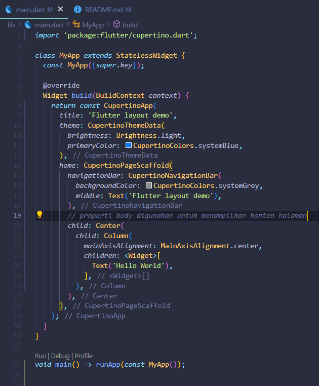

Hasil di web

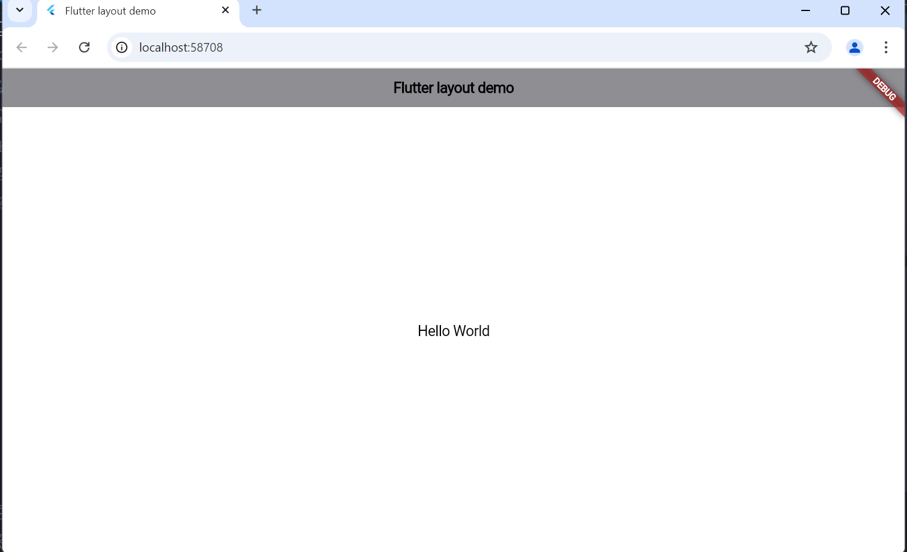

3.Membuat Non-Material APPS

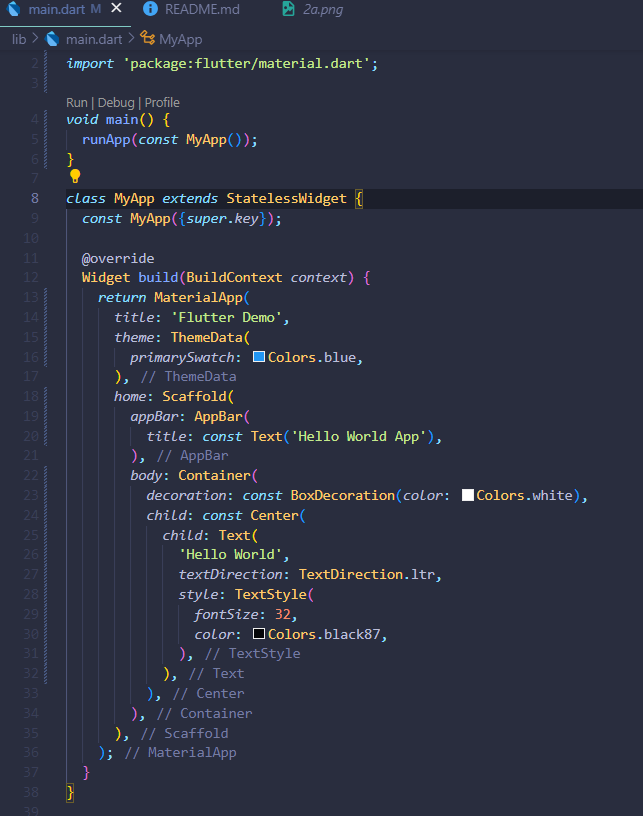

Hasil di web

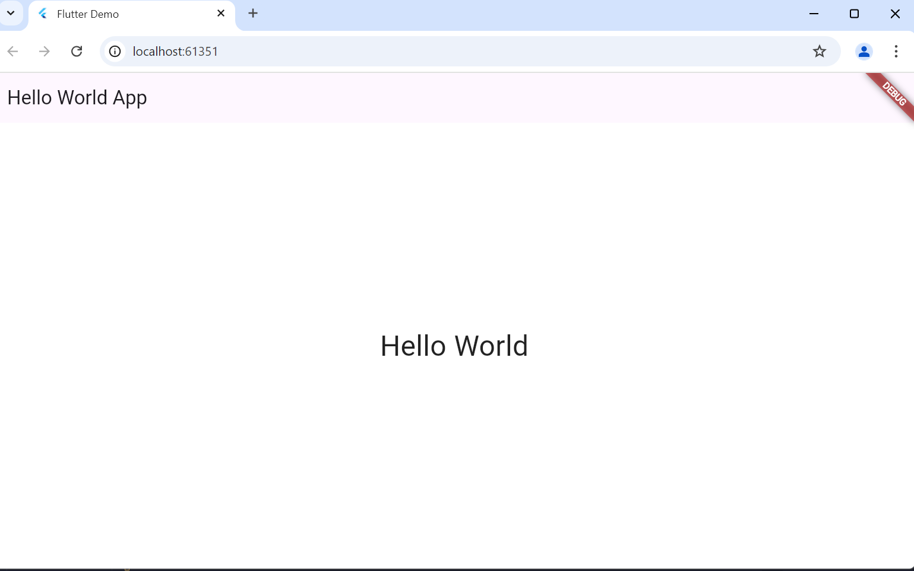

4.Membuat tata letak widget secara vertikal dan horizontal

a.Secara Horizontal

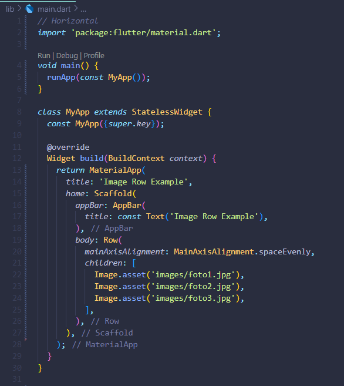

Hasil di web

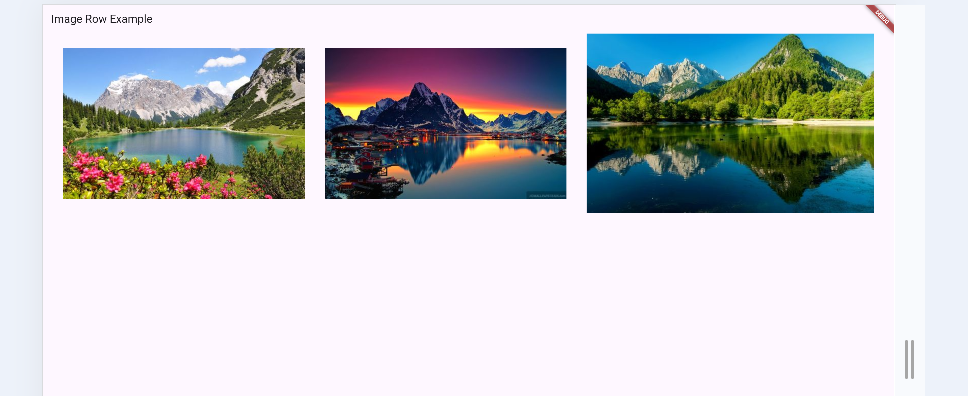

b.Secara Vertikal

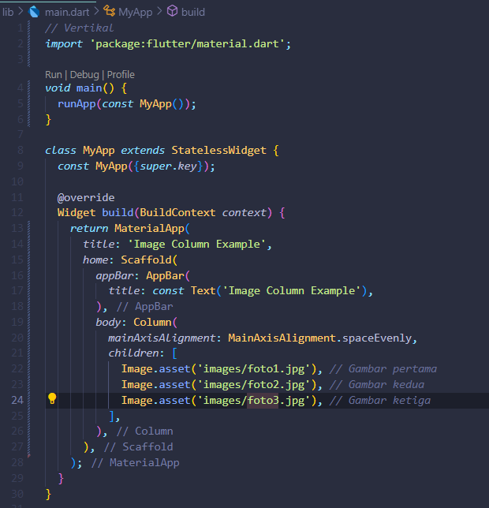

Hasil di web

5.Membuat Sizing widget

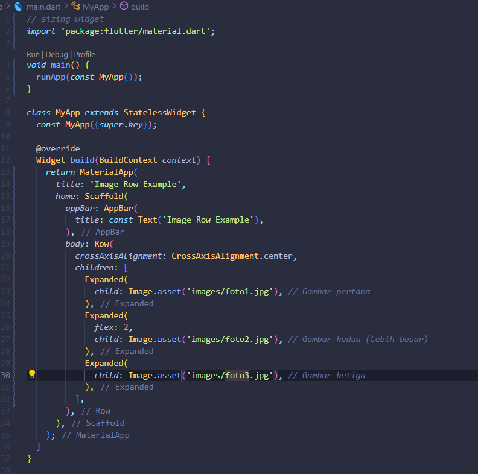

Hasil di web

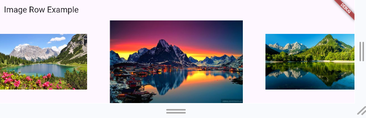

6.Membuat Packing Widget

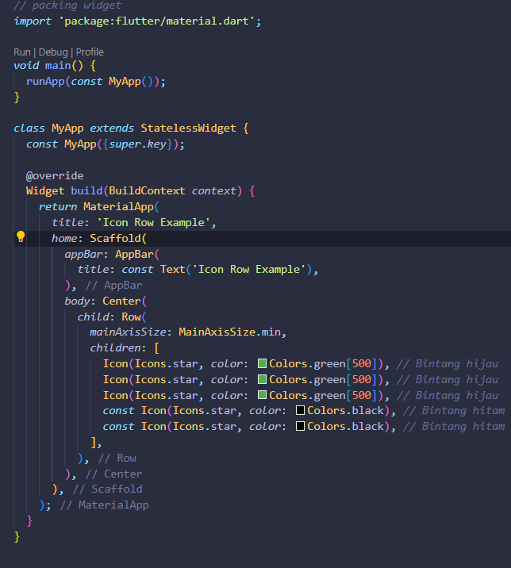

Hasil di web

7.Membuat group Banyuwangi Island

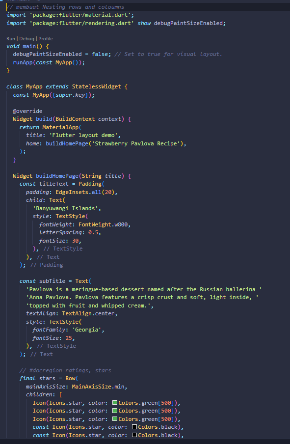

Hasil di web

8.Membuat Grid

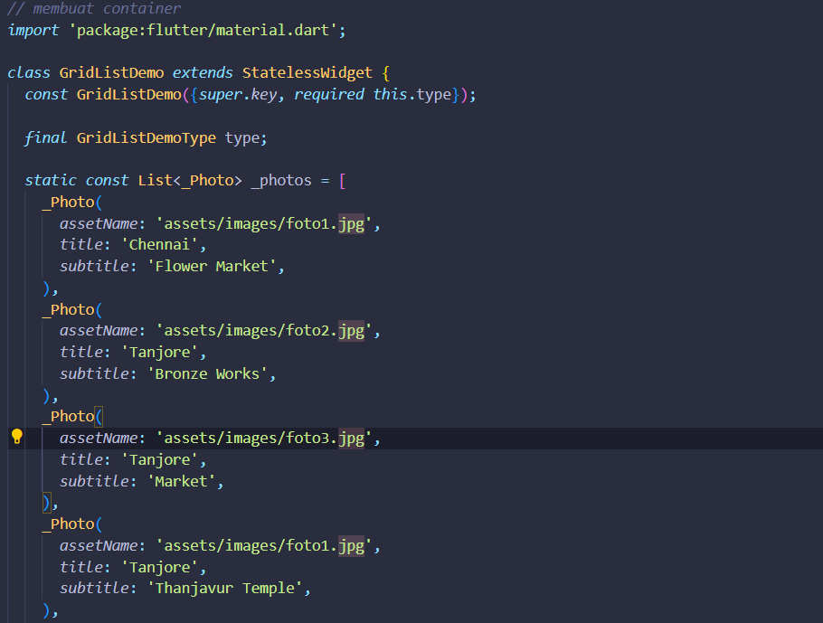

Hasil di web

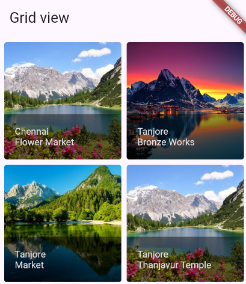

9.Membuat Colour

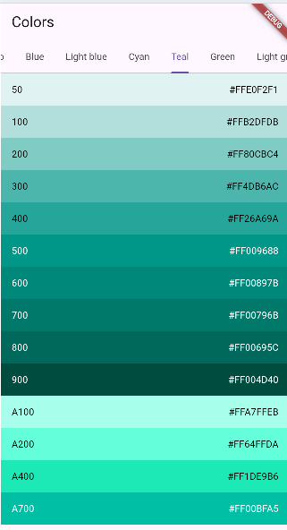

Hasil di web

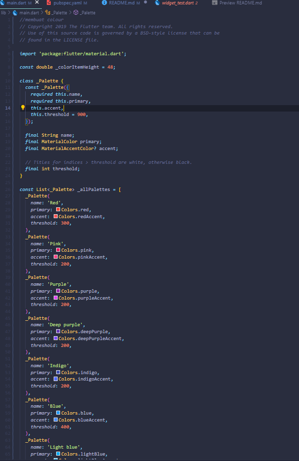

