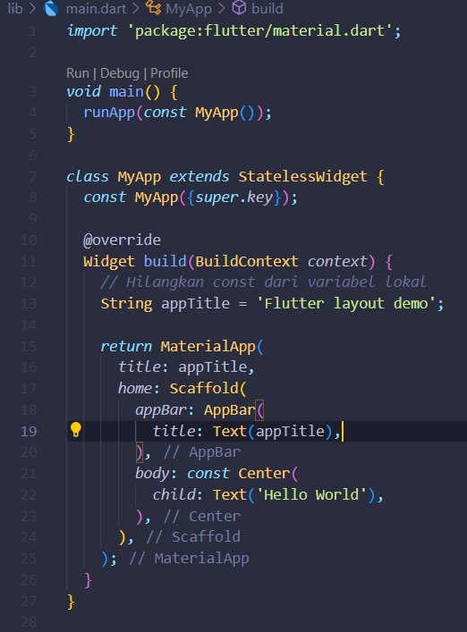
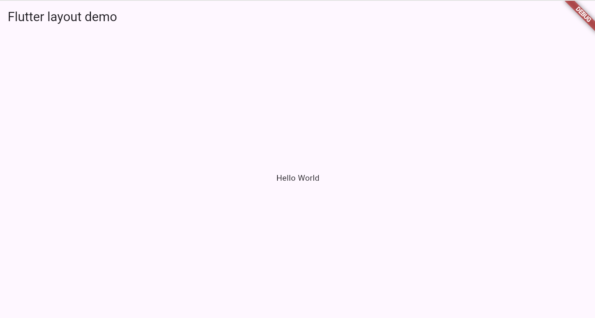
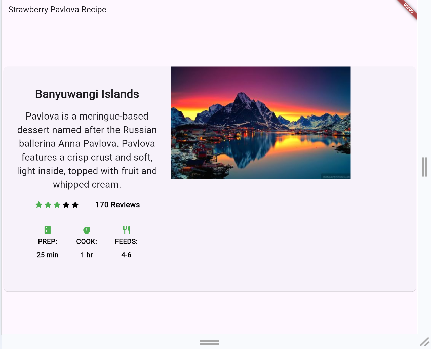

Nama :MOH. ARBI ARDIANSYAH

NIM :362358302150

Kelas :2B TRPL

1.Menambahkan Widget tata letak ke halaman

Hasil di web

2.Membuat Aplikasi Cuppertino

Hasil di web

3.Membuat Non-Material APPS

Hasil di web

4.Membuat tata letak widget secara vertikal dan horizontal

a.Secara Horizontal

Hasil di web

b.Secara Vertikal

Hasil di web

5.Membuat Sizing widget

Hasil di web

6.Membuat Packing Widget

Hasil di web

7.Membuat group Banyuwangi Island

Hasil di web

8.Membuat Grid

Hasil di web

9.Membuat Colour

Hasil di web

